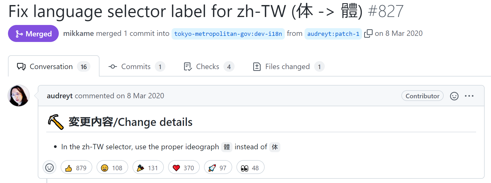

<!--
_class: lead invert
-->

# OSSへの**コントリビュート**のすすめ

---

<!--
_class: lead invert
-->

## みなさんOSSに**コントリビュート**してますか？

 

#### **ハードルが高い**と思っている人も多いと思いますが
#### 実は**意外と自分でも**やれたりしますよ💪

---

## 今日お話しすること
 

#### ● OSSへのコントリビュートって**具体的に何を**すればいいの？
 

#### ● コントリビュートして**いいこと**あるの？
 

#### ● **どのOSSに**コントリビュートしたらいいの？

---

<!--
_class: lead invert
-->

### コントリビュートって**具体的に何を**すればいいの？

---

## コントリビュートって何するの？
 

#### ● バグや機能追加の**Issue：問題**を報告する
 

#### ● Issueを解決する**PR：プルリク**を出す😀
 

🔽 🔽 🔽

#### でもPR出せるほどの**プログラミング力**なんかないよ．．．😢

---

## コードの修正だけがPRじゃないですよ
 

#### ● **機能を追加**するコードの作成を行う
 

#### ● **バグを修正**するコードの改善を行う
 

#### ● ドキュメントなどの**ローカライゼーション**に協力する😀
 

#### ● ドキュメントなどの**typo**を修正する😀
 

---

### この**神展開**知ってますか？

[https://github.com/tokyo-metropolitan-gov/covid19/pull/827](https://github.com/tokyo-metropolitan-gov/covid19/pull/827)

---

<!--
_class: lead invert
-->

## コントリビュートして**いいこと**あるの？

---

## こんなメリットがあります
 

#### ● **技術力・経験値**の向上につながる
 

#### ● エンジニアとしての**アピールポイント**
 

#### ● **英語でのコミュニケーション**能力アップ
 

---

<!--
_class: lead invert
-->

### なにより．．．
 

## 有名OSSにコントリビュートするって
## **かっこよくないですか！？** 😎

---

<!--
_class: lead invert
-->

## **どのOSSに**コントリビュートしたらいいの？

---

## このあたりがおすすめです
 

#### ● お世話になっているOSSの**Issue**や**ドキュメント**を読もう
 

#### ● [Good First Issue](https://goodfirstissue.dev)から初心者向けのIssueを探す
 

#### ● ドキュメントの**翻訳系**のIssueを探す
 

---

## 個人的なおすすめはこれ
 

### **普段自分が使っている**OSSで見つけた不具合の修正を自分でやってみよう👍

🔽 🔽 🔽

### ● 自分の困りごとが自分で解決できる🎉

### ● お世話になっているOSSに貢献できる✨

---

<!--
_class: lead invert
-->

## 結局言いたいことは
 

## OSSへのコントリビュートって**意外と簡単**🙌

## それなら是非**やってみよう**👌

---

<!--
_class: lead invert
-->

# Thank **You** for Reading 😃
